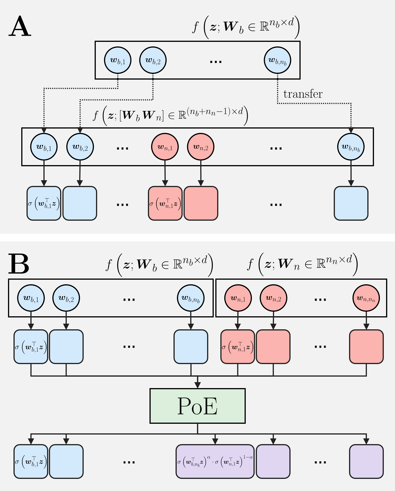
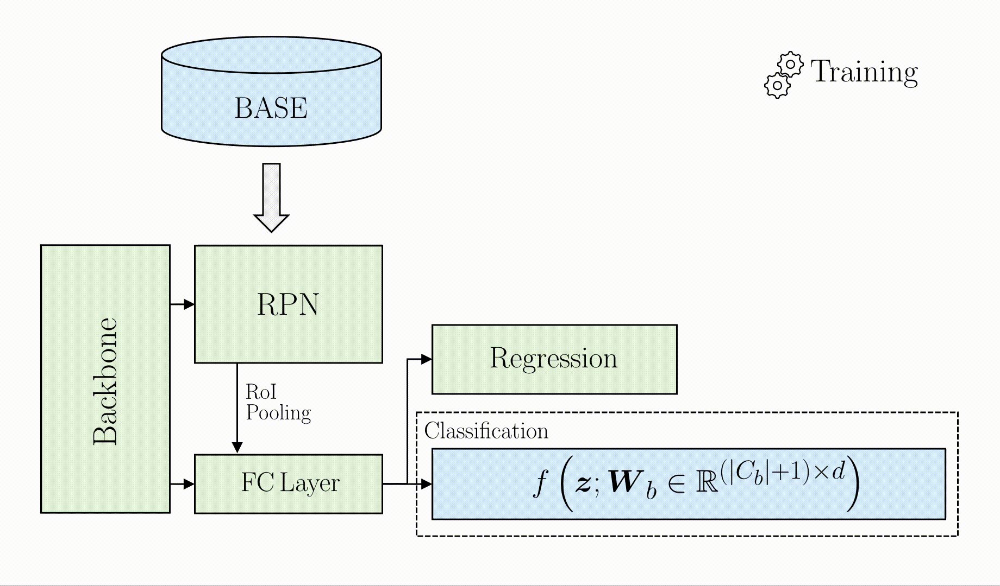

# 转移学习在少样本学习中的致命缺陷：基于专家乘积（Product-of-Experts）的解决思路

转移学习是深度学习领域中最为广泛且成功的技术之一，并已成为少样本目标检测任务中的核心解决方案。然而，本文发现，现有转移学习范式在少样本检测中存在一个长期被忽视却影响深远的内在缺陷，该问题在微调阶段会系统性地削弱模型对新类别的判别能力。进一步分析表明，这一问题并非不可避免的性能瓶颈，反而蕴含着进一步提升检测性能的潜在空间。基于这一关键洞察，本文提出对该弱点进行合理建模与利用，从而显著提升少样本目标检测的整体性能。

## AI 与人类对“背景”的认知差异
为什么 AI 检测器能够识别目标类别？其核心在于训练有素的分类器。在目标检测流程中，模型首先定位可能存在物体的候选区域，随后由分类器对这些区域进行判别：若区域内不存在任何目标实例，则被归类为“背景”。这一机制构成了当前主流目标检测算法的基本框架。

然而，值得注意的是，AI 所认知的“背景”与人类直觉中的背景并不完全一致。由于训练标签的定义方式，凡是未在训练集中被明确标注为目标类别的区域，都会被统一视为“背景”。这种基于标注规则形成的背景概念，与人类基于语义和场景理解形成的背景认知之间，存在着本质差异。

## 转移学习在少样本学习中的致命缺陷
这一隐含假设长期以来被忽视，尤其在转移学习场景下影响更加明显。当我们希望检测器识别新的类别时，通常的做法是在保留原有模型参数的基础上，为分类器增加新的类别，而不重新训练已学习的旧类别，其中也包括“背景”类。然而，这种做法忽略了一个关键事实：分类器可能已经见过新类别的实例，只是由于未被标注而将其错误地学习为背景。

因此，在随后的微调过程中，分类器不仅需要学习对新类别的判别能力，还必须纠正已有的背景认知。在训练数据充足的情况下，这一问题尚可缓解，但在少样本学习条件下尤为困难。仅依赖极少量的新类别样本，往往难以纠正这一错误行为。进一步而言，由于微调时通常会冻结部分模型参数以避免过拟合，这种错误表征可能无法被有效修正，甚至在模型中长期保留。

*图1：COCO 训练集中新类别的出现频率分布。
红色部分表示未被标注的新类别样本，这些物体在训练过程中会被分类器错误地视为“背景”。可以观察到，在图像中出现的所有物体中，超过一半属于新类别却未被标注，从而被大量纳入“背景”类的训练。*

## 背景冲突的另一种解法：独立训练与专家乘积
既然直接纠正原有分类器中对“背景”的错误认知十分困难，我们可以转而独立训练一个新的分类器，并保留原有分类器不变。在原有分类器中，“背景”类仍会将新加入的类别视为背景，而新训练的分类器则专门负责区分新类别目标与真实背景。这样一来，两者的训练目标并不冲突：原有分类器可以有效排除非新加入类别的目标，而新的分类器则进一步细分前景与背景，从而专注于新类别的判别。

在进一步的理论推导中，我们发现该机制在数学上可以自然地解释为专家乘积（Product-of-Experts）模型。通过对多个独立分类器的判别结果进行组合，该方法能够有效缓解转移学习中“背景”类定义所引发的冲突，并在实际实验中相较于传统转移学习策略取得了显著的性能提升。

*图2：传统转移学习与本文提出的专家乘积（PoE）结构对比。
A：传统转移学习方法在原有分类器中直接引入新的类别，并在微调过程中保留大部分原有参数，其中也包括“背景”类。然而，引入新类别后，“背景”的语义定义与原有定义发生冲突，从而显著加重了训练难度。
B：本文方法通过独立训练一个新的分类器并保留原有分类器不变，随后利用专家乘积（PoE）对两者的输出进行组合，从而更准确地估计目标类别的概率。*

## 新类别样本并不稀缺，只是未被标注
在少样本学习中，新类别的标注样本极为稀缺。然而，原有数据集中往往潜藏着大量未被标注的新类别样本，而这些样本在传统转移学习中反而成为性能提升的阻碍。本文认为，这些样本并非噪声，只是尚未被利用的潜在资源。

本文的思路很直接：利用少样本微调后的检测器，在数据集中自动发现隐藏的新类别目标，并将其中置信度较高的检测结果用于进一步微调模型。当然，由于少样本条件下训练得到的检测器并不完美，无法盲目使用所有检测结果。为此，本文结合检测器的置信度评估与批次采样策略，对候选样本进行筛选，从而在有效利用未标注样本的同时，降低错误累积带来的风险。

*图 3：本文提出的少样本目标检测训练流程示意图。*

## 结语
本研究揭示了转移学习在少样本学习中长期被忽视的关键缺陷，并基于专家乘积（PoE）对转移学习中“背景”类别的错误建模进行了有效修正。同时，本文进一步挖掘并利用了训练集中未被标注的潜在样本，用以扩充微调阶段的训练数据。在无需改变原有模型结构的前提下，该方法成功将这一原本制约性能的致命问题转化为提升少样本检测性能的关键因素。
